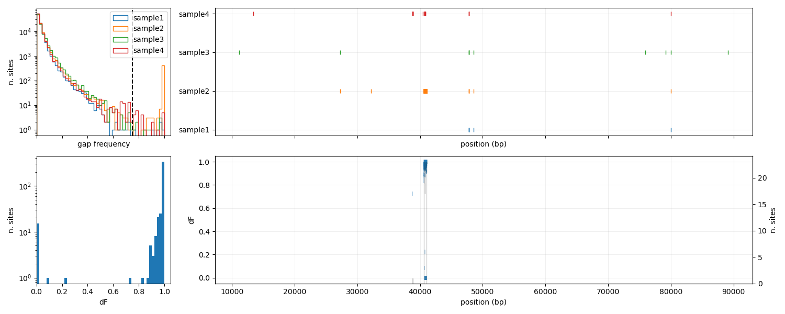
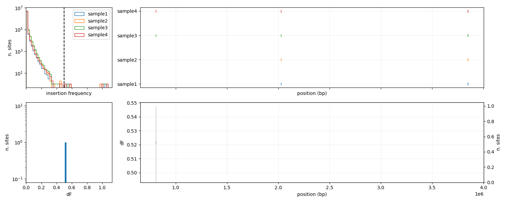
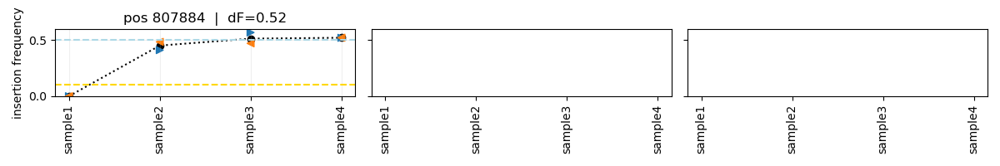
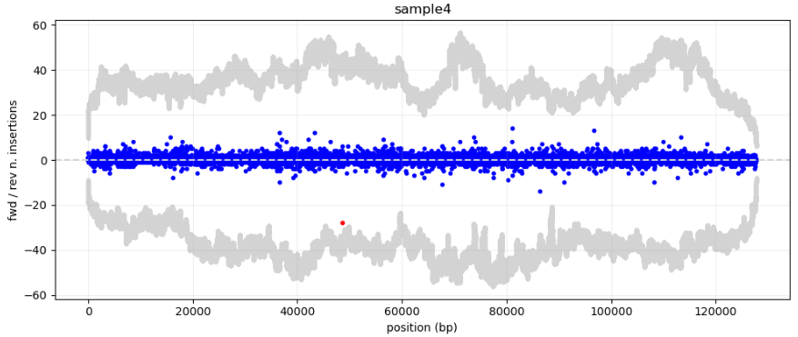
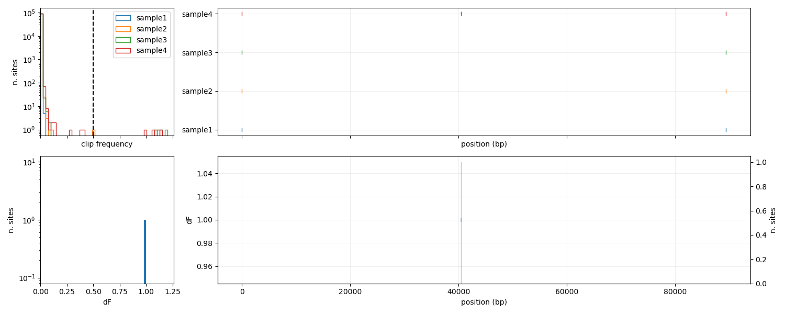
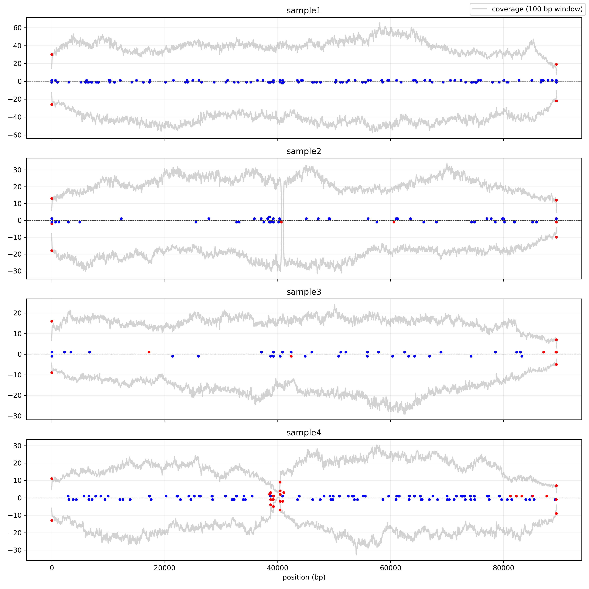
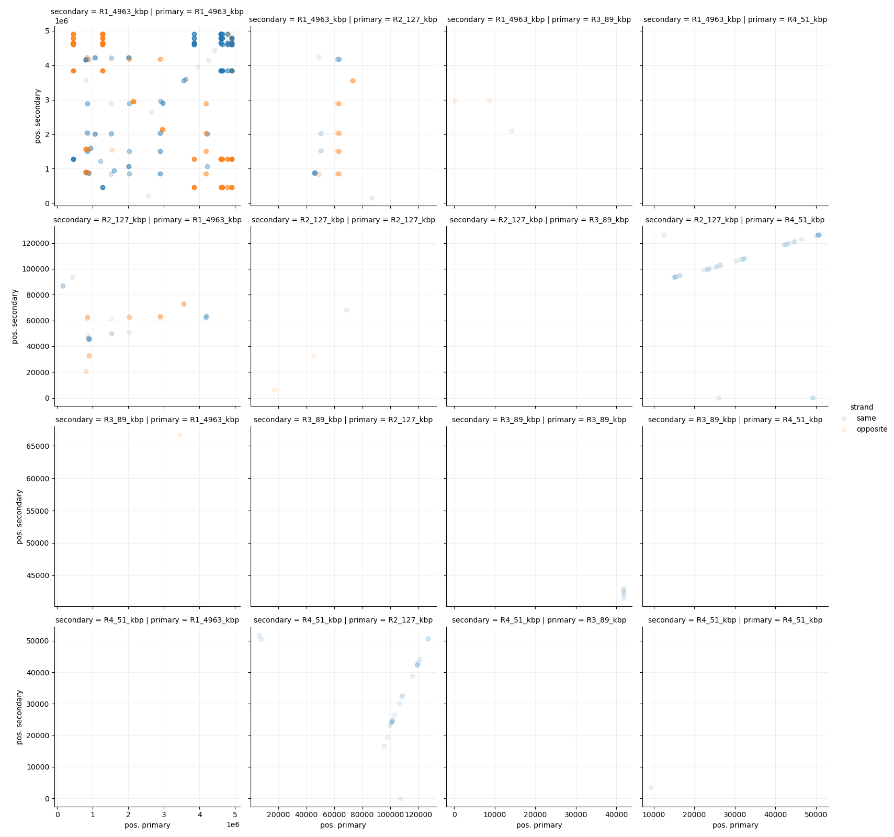

# plot description

<!-- table of contents -->
## contents

- [coverage](#coverage)
- [consensus](#consensus)
- [gaps](#gaps)
- [insertions](#insertions)
- [clips](#clips)
- [secondary/supplementary alignments](#secondarysupplementary-mappings)

## coverage 

- left panel: cumulative distribution of coverage over all sites. Vertical dashed lines indicate the median.
- right panel: coverage distribution over the reference, renormalized to the average coverage. This is done to compare fluctuations. There is some level of smoothing: each point represents the average coverage over a window of a given size (reported in the title). The size of the window is chosen so that the number of bins does not exceed the `coverage-maxbins` parameter in the config file. This parameter can be used to tune the window size.

This plot is also produced in an html interactive version done with plotly.

## consensus

### definitions

- **non-consensus frequency**: frequency at which a non-consensus nucleotide is observed at a given position.
- **deltaF**: when multiple samples are given, the delta-frequency at a given position represents the difference between maximum and minimum non-consensus frequency observed at that position.
  - since frequency are subject to sampling noise, we set a minimum coverage threshold `coverage-threshold` in the config file. For each sample, only positions with fwd and rev coverage both above this threshold are considered.
  - to exclude most of the uninteresting positions, we set a minimal frequency threshold (`freq-threshold` in the config file). Only positions with Fmax above this threshold are assigned a delta-frequency.

### non-consensus summary

- upper left: distribution of non-consensus frequencies over all positions, stratified by sample. The vertical dashed line indicates the threshold frequency. Only above-threshold positions appear on the plot on the right.
- upper right: position of sites with above-threshold non-consensus frequency, for each sample.
- lower left: distribution of delta-frequency values over all relevant positions.
- lower right: position of sites with above-threshold delta-frequency. The y-coordinate represents the value of delta-F. On top we overlay a histogram to highlight regions of high density.

We also export an interactive version of the plot for the upper-right panel with plotly.

### non-consensus trajectory

We rank relevant positions - i.e. sites with an assigned delta-frequency - by value of delta-frequency, and select the top `n-top-trajs` (see config file). This is done to select preferentially sites with large variation across different samples, and not sites which are non-consensus across all samples, maybe due to sequencing artifacts or genome assembly artifacts.

For each selected position we plot the non-consensus frequency (black line). We also indicate the forward (blue right arrow) and reverse (orange left arrow) frequencies. This is a proxy measure of noise in the frequency determination. A large discrepancy between these two values might indicate an artifact of sequencing. These arrow have high transparency if (fwd or rev) coverage is below the `coverage-threshold`.

### csv file

We also export a csv file with informations on all relevant positions:

| deltaF | pos     | F_sample1 | F_sample2 | F_sample3 | F_sample4 |
| ------ | ------- | --------- | --------- | --------- | --------- |
| 1.0    | 1979193 | 0.000     | 0.000     | 1.000     | 0.000     |
| 0.987  | 3797185 | 0.987     | 0.029     | 0.000     | 0.000     |
| 0.940  | 1979194 | 0.000     | 0.000     | 0.940     | 0.000     |
| 0.134  | 2949669 | 0.706     | 0.768     | 0.835     | 0.701     |
| 0.106  | 3846193 | 0.856     | 0.959     | 0.962     | 0.962     |

Columns indicate:
- `deltaF`: delta-frequency.
- `pos`: position on the reference (1-based).
- `F_{sample-id}`: non-consensus frequency for the considered sample.

## gaps

### definitions

- **gap frequency**: n. of times a gap is observed in a given position, divided by the total number of observations (gaps + other nucleotides).
  - Forward and reverse reads are grouped together to evaluate an average gap frequency.
- **deltaF**: when multiple samples are given, the delta-frequency at a given position represents the difference between maximum and minimum gap frequency observed at that position.
  - since frequency are subject to sampling noise, we set a minimum coverage threshold `coverage-threshold` in the config file. For each sample, only positions with fwd and rev coverage both above this threshold are considered.
  - to exclude most of the uninteresting positions, we set a minimal frequency threshold (`freq-threshold` in the config file). Only positions with Fmax above this threshold are assigned a delta-frequency.

### gap summary

- upper left: distribution of gap frequencies over all positions, stratified by sample. The vertical dashed line indicates the threshold frequency. Only above-threshold positions appear on the plot on the right.
- upper right: position of sites with above-threshold gap frequency, for each sample.
- lower left: distribution of delta-frequency values over all relevant positions.
- lower right: position of sites with above-threshold delta-frequency. The y-coordinate represents the value of delta-F. On top we overlay a histogram to highlight regions of high density.

We also export an interactive version of the plot for the upper-right panel with plotly.

### gap trajectories

We group relevant sites - i.e. sites with an assigned delta-frequency - into clusters, so that relevant sites that are immediately adjacent belong to the same cluster. This is done to group large gaps together. We then rank clusters by their average delta-frequency and selecte the top `n-top-trajs` clusters (see config file). This is done to preferentially select sites in which the gap frequency varies over different samples.

Each cluster is assigned a panel, whose title indicates the positions and delta frequency. For each site in the cluster (possibly only one site) we plot the gap frequency for each sample (black line). For each sample we also indicate the forward (blue right arrow) and reverse (orange left arrow) frequencies. This is a proxy measure of noise in the frequency determination. A large discrepancy between these two values might indicate an artifact of sequencing. These arrow have high transparency if (fwd or rev) coverage is below the `coverage-threshold`.

### csv file

The frequencies and delta-frequencies for all relevant (as defined by delta-frequency) positions are exported in a csv file.

| deltaF | pos   | F_sample1 | F_sample2 | F_sample3 | F_sample4 | gap_cluster |
| ------ | ----- | --------- | --------- | --------- | --------- | ----------- |
| 1.00   | 40790 | 0.024     | 1.000     | 0.103     | 0.000     | 11          |
| 1.00   | 40791 | 0.000     | 1.000     | 0.062     | 0.000     | 11          |
| 0.98   | 40789 | 0.012     | 0.981     | 0.032     | 0.000     | 11          |
| 0.96   | 34535 | 0.000     | 0.960     | 0.000     | 0.000     | 2           |

Positions are ordered by `deltaF`. Columns are:
- `deltaF`: delta-frequency
- `pos`: position on the genome (1-based)
- `F_{sample-id}`: frequency in each sample.
- `gap_cluster`: positions that are adjacent are assigned to the same gap-cluster. This column contains the id of the cluster.

## insertions

### summary

Similarly to consensus frequency and gaps, we generate a summary plot for **insertion frequency**, defined as the number of insertion on a given site divided by the average coverage of the site before and after the insertion. Notice that this frequency estimation is noisy and can occasionally be greater than one. Sites with above-threshold frequency (see config file) are selected and the delta-frequency is evaluated and displayed.

### trajectories

Similarly to consensus frequency and gaps, also for these sites the insertion frequency trajectories are displayed as in this example. The numerical values for each trajectory are exported in `insertion_traj.csv`.

### n. of insertions

If an insertion fixates in the population, this will be visible as a region with a high number of insertions, comparable to the coverage in that region.
To detect this in this plot we display the number of insertions per site (blue dots), and compare it to the coverage averaged over a sliding window of `coverage-window` bp (gray dots, see config file). Points whose number of insertions are above a fraction `coverage-fraction` of the average coverage are highlighted in red.

The sample, position, strand, and number of insertions of these highlighted data-points are exported in a csv file `n_insertions.csv`.

## clips

The overhangs of reads that only partially map to the reference are saved as **clips**. A region with a high clip density might indicate a long insertion/deletion or a genomic rearrangements. For circular genomes, the beginning and end of the reference always contain a high number of clips.

### summary

The **clip frequency** is defined as the number of clips in a given position divided by the maximum coverage of the position before/after the clip. Notice that since coverage is subject to quality-filtering this fraction can occasionally be greater than one. The coverage frequency and delta-frequency are displayed as in a summary plot, similar to the previous ones. The parameter of the plot can be set in the config file.

### trajectories

Similarly to the other cases, above-frequency-threshold trajectories are displayed in a trajectory plot. The numerical values for each trajectory are exported in `clip_trajs.csv`.

### n. of clips

Moreover, similarly to what done for insertions, the number of clips per site is displayed, and compared to the average coverage over a sliding window of `coverage-window` bp (gray dots, see config file). Points whose number of clips are above a fraction `coverage-fraction` of the average coverage are highlighted in red.

## secondary/supplementary mappings

Reads that can be mapped on multiple references are saved as secondary or supplementary mappings.
Every read that can be mapped to a reference is associated to a **primary mapping**.
- A **secondary mapping** is associated to a mapping between the same part of the read that is covered by the primary mapping, and a different part of the reference. This occurs for example in the context of duplications.
- A **supplementary mapping** is associated to a mapping between a different part of the read (not covered by the primary mapping) and another part of the reference. This usually indicates a large deletion or a genomic rearrangement.

We display these mappings as a matrix, with on the x-axis the position of the primary mapping and on the y-axis the position of the secondary mapping. The color indicates whether the mappings have compatible strandedness (fwd/fwd or rev/rev - blue) or are inverted (fwd/rev or rev/fwd - orange).

For secondary mappings the coordinate considered is the middle point between the start and end of the mapping on the reference. For secondary mappings we consider either the start or end of the read of the reference, depending of the relative orientation of the mappings on the query.