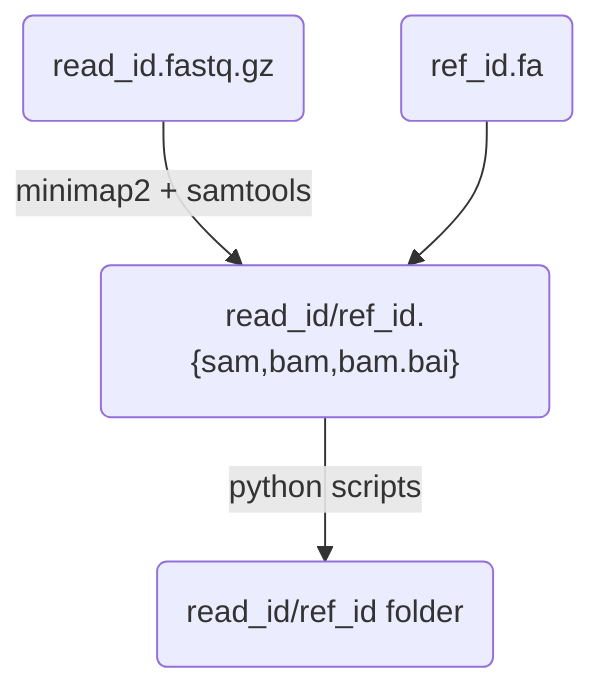
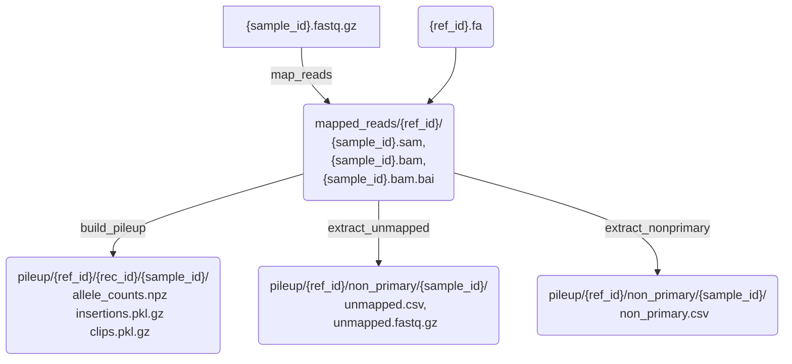

# Pipeline setup

## general principles

Separate pileup and plots part.

the **pileup** part is only a function of read and reference (possibly multiple references).


The `read_id/ref_id` folder contains
- some summary file on the distribution of primary/secondary reads vs different references (matrix?).
- a set of `record_id` subfolders with the pileup, clips and insertions for reads having primary mapping on the corresponding record, and possibly primary-secondary or primary-supplementary mappings on the same record.

The **plots** part will take these output files to produce summary plots and summary csv files.

## input
```
input/
├── reads
│   ├── sample_1.fastq.gz
│   ├── sample_2.fastq.gz
│   └── ...
└── references
    ├── ref_1.fa
    ├── ref_2.fa
    └── ...
```
**References** must be fasta files (with short record names?)
**Reads** must be fastq files with extension `fastq.gz`

## config file

For the **pileup** part, the config folder contains pairs of reference fasta files and corresponding set of reads to be mapped. Input and output folders can either be specified or have default values.
```yaml
input: "input_fld"
output: "output_fld"
ref_1:
  - "reads_1"
  - "reads_2"
  - ...
ref_2:
  - "reads_1"
  - "reads_2"
  - ...
```

**Plots**: the config file contains set of figures, each one with its own reference and samples set.
```yaml
input: "input_fld"
output: "output_fld"
figure_1:
  reference: "ref_1.fa"
  samples:
    - "reads_1.fastq.gz"
    - "reads_2.fastq.gz"
    - "reads_3.fastq.gz"
    - ...
figure_2:
  reference: "ref_1.fa"
  samples:
    - "reads_1.fastq.gz"
    - "reads_5.fastq.gz"
    - ...
figure_3:
  reference: "ref_2.fa"
  samples:
    - "reads_1.fastq.gz"
    - "reads_6.fastq.gz"
    - ...
```

## pileup workflow

For each reference file `{ref_id}` multiple records `{rec_id}` can be present. For each pair of reference and sample `{sample_id}` given in the configuration file the following operations are performed in the workflow:



### output file description by rule

- `extract_unmapped`: rule to extract unmapped reads. These will contain possible contaminations that do not map to any of the references.
  - `unmapped.csv`: dataframe with one entry per unmapped read. Columns are query name, read length, average quality score and read flag in the sam file.
  - `unmapped.fastq.gz`: fastq file containing unmapped reads.
- `extract_nonprimary`: rule to create a csv file containing info
  - `non_primary.csv`: contains one line per mapping, and the following columns:
    - `qry`/`ref`: reqference and query name
    - `qry_len`: query length. It is the length of the query sequence inferred from the cigar string, including hard clips (it's zero if the sequence is unmapped).
    - `ref_len`: length of the aligned portion on the reference.
    - `n_matches`: total n. of nucleotide matches in the cigar string.
    - `flag`: sam file flag of the mapping.
    - `fwd`/`sec`/`suppl`: whether the mapping is forward / secondary / supplementary
    - `rs`/`re`/`qs`/`qe`: reference/query start and end positions. Differently from the sam file, this is always in the forward frame of reference, so that start and end points can be compared for different mappings.